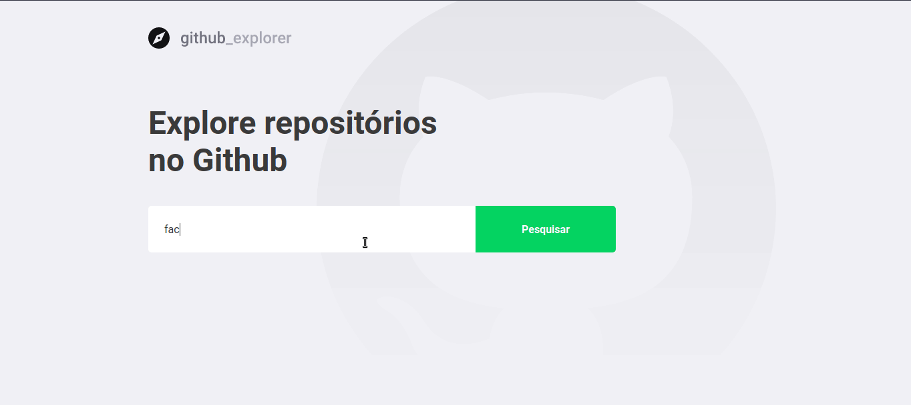

### :checkered_flag: Execute o projeto localmente:

```bash
# Clone este repositório
$ git clone https://github.com/JonasCastro/github-explorer.git

# Acesse a pasta do projeto no terminal/cmd
$ cd github-explorer

# Instale as dependências
$ yarn

# Execute a aplicação em modo de desenvolvimento
$ yarn start
 
```
## :memo: Licença

Esse projeto está sob a licença MIT. Veja o arquivo [LICENSE](LICENSE) para mais detalhes.

---

- Feito com :blue_heart: by Jonas Castro :wave: [Stay in touch!](https://www.linkedin.com/in/jonas-castro-b4044111a/)
